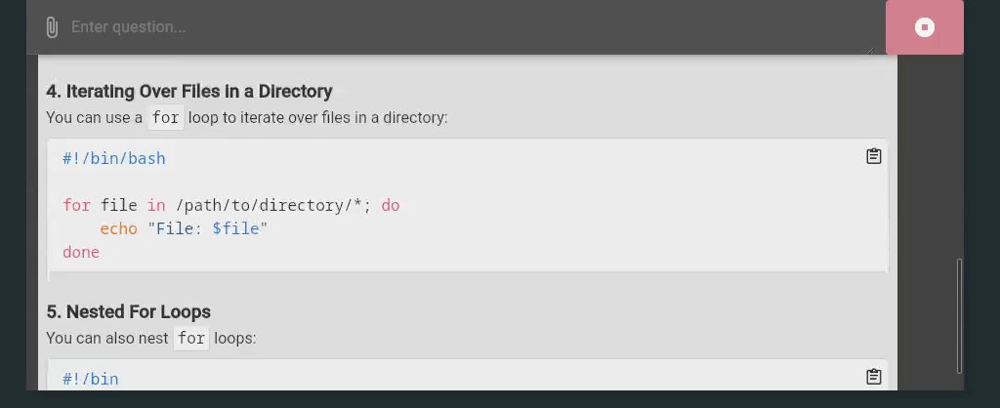

# Ask m' AI

**Ask m' AI** (ask my ai -> ask m' ai) is a little Desktop-Chat-Application for LargeLanguageModels (e.g. OpenAI's GPT).

Unlike many chat applications out there, this application aims to be scriptable. 
Which means you can call it from you terminal and gave all necessary options as arguments. 
The conversations will also be printed out in the terminal, so you can use it in your scripts. 



https://github.com/user-attachments/assets/a6d16332-55a1-4866-9f3e-31490a488935

## Quickstart

### LocalAI

```shell
ask-mai -b localai --llm.localai.base-url=http://localhost:8080/v1 --llm.localai.model=gpt-4
```

### OpenAI

```shell
ask-mai -b openai --llm.openai.api-key.plain=YOUR_OPENAI_API_KEY
```

### Ollama

```shell
ask-mai -b ollama --llm.ollama.server-url=http://localhost:11434 --llm.ollama.model=llama3.2
```

### Anthropic

```shell
ask-mai -b anthropic --llm.anthropic.api-key.plain=YOUR_ANTHROPIC_API_KEY
```

### Mistral

```shell
ask-mai -b mistral --llm.mistral.api-key.plain=YOUR_MISTRAL_API_KEY --llm.mistral.model=mistral-small-latest
```

### DeepSeekConfig

```shell
ask-mai -b deepseek --llm.deepseek.api-key.plain=YOUR_DEEPSEEK_API_KEY
```

## Features

* Support different LLM provider
  * [Github Copilot](https://github.com/features/copilot)
  * [OpenAI](https://openai.com)
  * [LocalAI](https://localai.io/)
  * [AnythingLLM](https://anythingllm.com/)
  * [Ollama](https://ollama.com/)
  * [Mistral](https://mistral.ai/)
  * [Anthropic](https://www.anthropic.com/)
* Tool Support
  * You can define your own tools which can be called from the LLM
  * There are some built-in tools:
    * "_getSystemInformation" - Get some information about the system
    * "_getEnvironment" - Read environment variables from the system
    * "_getSystemTime" - Get the current system time
    * "_getStats" - Get stats of a file or directory
    * "_changeMode" - Changes the mode of file or directory
    * "_changeOwner" - Changes the owner of file or directory
    * "_changeTimes" - Changes the access and/or modification time of file or directory
    * "_createFile" - Create a file on the system
    * "_createTempFile" - Create a temporary file on the system
    * "_appendFile" - Append content to an existing file
    * "_readTextFile" - Read a text file from the system
    * "_deleteFile" - Delete a file from the system
    * "_createDirectory" - Creates a new directory on the system
    * "_createTempDirectory" - Creates a new temporary directory on the system
    * "_deleteDirectory" - Delete a directory from the system
    * "_executeCommand" - Execute a command on the system
    * "_callHttp" - Do a http call
* [MCP](https://www.anthropic.com/news/model-context-protocol)-Server support
  * You can define multiple MCP-Servers which can be used by the LLM (currently only tools)
* Scriptable
  * All settings can be set via:
    * yaml configuration file 
    * environment variables
    * command line arguments
  * The users questions and models answers will be printed out in the terminal
* Customizable
  * Choose between two themes (light and dark)
  * Choose between different languages (english, german)
  * Choose between different code themes (see help for all available themes)

## Install this application

### AUR (Arch Linux)

```bash
yay -S ask-mai
```

## Download this application

You can download the latest version of this application from the [releases page](https://github.com/rainu/ask-mai/releases).
There are many different versions for different operating systems, architectures and feature sets.

The file names are structured as follows:
```
ask-mai-${OS}-${ARCH}-${FEATURE}.${EXTENSION}
```

Available OS:
* darwin - MacOS
* linux - Linux
* windows - Windows

Available Architectures:
* amd64 - 64bit
* 386 - 32bit
* arm64 - ARM 64bit

Available Features:
* compressed - The binary is compressed (can be problematic for some antivirus software - especially on windows)
* console - The binary is console application (only for windows)
* debug - The binary contains devtools (you can inspect the GUI-Sources)

## How to build this application

1. Install dependencies [see wails documentation](https://wails.io/docs/gettingstarted/installation)
2. Build the application:
```sh
wails build
```

## How to build and install this application (flatpak) by yourself

```
flatpak-builder .flatpak-build de.rainu.ask-mai.yml --repo=.flatpak-repo --install-deps-from=flathub --force-clean --default-branch=master --arch=x86_64 --ccache
flatpak build-bundle .flatpak-repo ask-mai.flatpak --runtime-repo=https://flathub.org/repo/flathub.flatpakrepo --arch=x86_64 de.rainu.ask-mai master
sudo flatpak install --reinstall ask-mai.flatpak
```

## Application starts not fast enough

If the application does not start fast enough for your needs, you can get the prompt by your own and use the `-ui-prompt` flag to start the application with that prompt. 
Here is an example with [rofi](https://github.com/davatorium/rofi):

```sh
#!/bin/sh

PROMPT=$(rofi -dmenu -p "Ask-mAI" -l 0 -location 2)
if [ $? -ne 0 ]; then
    exit 1
fi

ask-mai -ui-prompt "${PROMPT}"
```

## Contributing

If you use [nix](https://nixos.org/), you can use `nix develop` to enter a shell with all dependencies you need for contributing. The flake also utilises [treefmt](https://github.com/numtide/treefmt-nix) to format all *.nix and *.go files. This can be done with `nix fmt` and checked with `nix flake check`.
